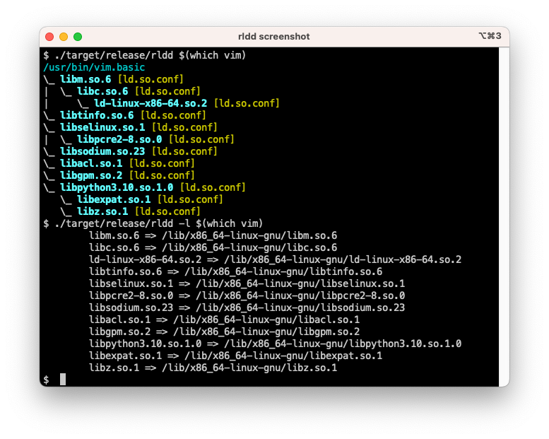

# rldd

The rldd tool resolves and prints the binary or shared library dependencies with different visualization options.  Similar to the Linux ldd tool, it does not invoke the system loader but instead parses the loading information directly from either ELF or Mach-O files, along with any required system files (such as loader cache or extra configuration files).

Currently it supports Linux (glibc, android, and musl), FreeBSD, OpenBSD, NetBSD, Illumos (no support for crle/ld.config, trusted directories, or any environment variable), and macOS.



## Output

The default visualization option prints unique dependencies, including loader and libc for Linux and BSD.

Use the '-a' option to print all dependencies (including already resolved ones), and the '-p' option to print fully resolved paths instead of just the soname.

The '-l' option mimics the ldd output, with unique libraries one per line.


## Building from source

```
git clone git@github.com:zatrazz/rldd.git
cd rlld
cargo build --release
```
