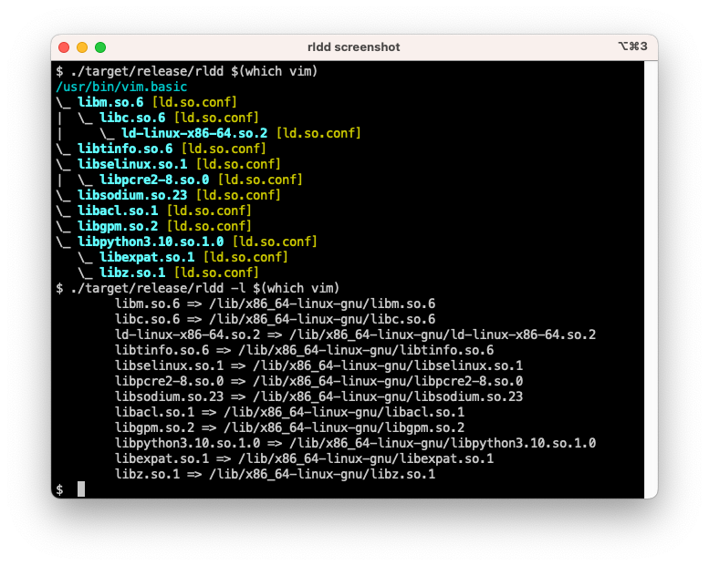

# rldd

The rldd tool resolves and prints the binary or shared library dependencies with different visualization options.  Unlike the Linux ldd tool, it does not invoke the system loader; instead, it parses loading information directly from ELF, Mach-O, or PE files, along with any required system files (such as the loader cache or extra configuration files).

Currently, it supports Linux (glibc, musl, and Android), FreeBSD, OpenBSD, NetBSD, Illumos, macOS, and Windows.



## Output

The default visualization option prints unique dependencies, including loader and libc for Linux and BSD.

Use the ‘-a’ option to print all dependencies (including already resolved ones), and the ‘-p’ option to print fully resolved paths instead of just the soname.

The ‘-l’ option mimics the ldd output, listing unique libraries on separate lines.  Since the loader is not invoked, no load addresses are printed, the entries follow the dependency resolution order instead of the loader load order, and the virtual objects provided by the kernel (like the Linux vdso) are not listed.  It also resolves binaries the loader refuses to trace, such as the set-user-ID ones or the ones without execute permission on the BSDs, where ldd runs the target under the loader.  A header line is only printed when multiple files are given, with the file base name instead of the full path the BSD ldd prints.

## Linux and BSD

On the ELF platforms, the dependencies are tracked from the DT_NEEDED entries (as ldd does), and resolved following the loader documented search order: the object DT_RPATH (ignored when the object also defines DT_RUNPATH), the ‘–library-path’ directories, the object DT_RUNPATH, the loader cache or hints file, and at last the default system directories (the NetBSD order differs, see below).  The $ORIGIN, $LIB, and $PLATFORM tokens are expanded on the rpath and runpath entries, and DF_1_NODEFLIB suppresses the cache and the default directories.

The $ORIGIN token follows each loader: glibc expands it to the directory of the path the object was loaded through, the FreeBSD and OpenBSD loaders canonicalize the object path first (so a symlink or a ‘..’ component on a search path is not kept), and the NetBSD loader expands it to the executable directory for every object.

The DT_RPATH scope used for the indirect dependencies follows each loader semantics:

* The glibc loader searches the object own DT_RPATH and then walks up the chain of loading objects (up to the executable).
* The FreeBSD and OpenBSD loaders search the object own DT_RPATH and then the main object one.
* The NetBSD loader only searches the requesting object one.

A DT_NEEDED entry naming the program interpreter resolves to the PT_INTERP path, the way the loader matches the entry against its own soname without any search.  Likewise, on glibc and FreeBSD a dependency or preload entry naming the input object own DT_SONAME is taken as already loaded and is not listed.

The loader environment variables are mimicked with options:

* ‘–library-path LIST’ (LD_LIBRARY_PATH) searches the colon-separated directories.
* ‘–preload LIST’ (LD_PRELOAD) preloads the listed objects (colon or whitespace separated). An entry containing a slash is taken as a file path, and the bare names are searched like a regular dependency (except on NetBSD, whose loader opens every entry as a file path).  On glibc the /etc/ld.so.preload file is also parsed.
* ‘–platform NAME’ sets the $PLATFORM value used on the rpath and runpath expansion, instead of deriving it from the object architecture.

The ‘-v’ option prints the search paths that apply to the input file (rpath, preload, library path, runpath, cache, and default directories), along with the locations searched for each dependency that was not found.

### Linux (glibc)

The loader cache is read directly from /etc/ld.so.cache (both the old and the current format are supported) with the entries filtered by the object architecture and hwcap bits. Some ABI extends with withglibc-hwcaps extension, which is also supported (an entry in a glibc-hwcaps subdirectory is only used when the running CPU supports it, and the best-fit subdirectory wins, for instance x86-64-v2/-v3/-v4).  The default directories are the slibdir hard-wired on the glibc install for the architecture (for instance /lib64 and /usr/lib64 on x86_64, or /libx32 and /usr/libx32 for x32 objects).

Like ldd, the dynamic loader is always listed, and the PT_INTERP path is used for executables.For shared libraries the loader soname is resolved through the cache and the default directories.  On the ‘-l’ output the loader is printed as a regular ‘name => path’ entry instead of the bare path line ldd uses.

### Linux (musl)

A binary is handled as a musl one when the interpreter is ld-musl-$(ARCH).so.1, when it depends on a libc.musl- object, or, for shared libraries without a PT_INTERP segment, when the system itself is a musl one.  There is no loader cache: the search path comes from the /etc/ld-musl-$(ARCH).path file (colon or newline separated), with /lib:/usr/local/lib:/usr/lib as the compiled-in default.  Since the musl loader and libc are the same shared object, the loader is always listed, and a dependency named lib{c,pthread,rt,m,dl,util,xnet}.* resolves to it without any search (the way the loader blocks reloading itself), reported once per reserved prefix like the musl ldd does.  The preloaded objects are always loaded, even for an object without any dependency.  The libc is only part of the symbol resolution scope when some object requests one of the reserved names.  On the ‘-l’ output the loader is printed as a regular ‘name => path’ entry instead of the bare interpreter path the musl ldd uses.

### Android

The dependencies are resolved with the ld.config.txt namespace configuration associated with the executable, the default namespace is searched first, followed by the namespaces it links against, restricted to the libraries each link makes accessible (the link ‘shared_libs’ list, unless it allows all of them) and to the names the linked namespace allows.  The configuration file is selected the way the loader does for the API level of the device: the one generated for the APEX the executable belongs to (/linkerconfig/&lt;apex&gt;/ld.config.txt), the architecture specific /system/etc/ld.config.&lt;abi&gt;.txt, the generated /linkerconfig/ld.config.txt, and the VNDK ones, in this order.

A dependency is searched on the namespace the requesting object was loaded in, and then on the namespaces it links against. An object resolved through a link has its own dependencies searched on the linked namespace.

The ‘dir.’ mappings only cover the directories an executable is run from, so a shared library never matches one.  Since a library is loaded by an executable, the section that maps the executable directory of the partition the library is on is used instead: /system/lib64/libfoo.so is resolved with the /system/bin section, and an object below /apex/&lt;name&gt; with the section of that APEX.  An executable that matches no directory does not fall back, the way the loader uses the default system directories for it.

When no configuration applies, the default system directories for the release are used: /system/lib[64], /odm/lib[64] (from Android 9 on), and /vendor/lib[64], each one preceded by the sanitizer specific directory for an ASan (/data/asan/...) or HWASan (.../hwasan) instrumented object, which are detected from the loader name (linker_asan[64] and linker_hwasan[64]).

DT_RPATH is not searched, since the bionic loader does not implement it (it warns about the unused dynamic entry and fails the load); only DT_RUNPATH is.  The recorded DT_RPATH is still shown on the ‘-v’ output, so an object that relies on one can be told apart from one with no search path at all.

The ${LIB} substitution and the library directory suffix follow the object ELF class, so a 32-bit object is resolved against the ‘lib’ directories even on a 64-bit device.  A DT_NEEDED entry naming the vDSO is not listed, since the loader resolves it against the image the kernel maps.

### FreeBSD

The search directories come from the /var/run/ld-elf.so.hints file (the 32-bit compat objects use /var/run/ld-elf32.so.hints) followed by the rtld standard paths (/lib/casper, /lib, and /usr/lib, or /lib32 and /usr/lib32 for the compat objects).  The /etc/libmap.conf mappings are applied to the dependency names following the rtld semantics: the mappings constrained to the referencing object (by exact path, directory prefix, or basename) are tried first, with the unconstrained ones as fallback.

Like the FreeBSD ldd, the loader is not listed on the ‘-l’ output; the ‘[vdso]’ pseudo entry ldd prints is not listed either.

### OpenBSD

The search directories come from /var/run/ld.so.hints and /usr/lib.  Like the OpenBSD loader, DT_SONAME is ignored, a dependency is matched by file name and major version, picking the best minor available in the directory (also for the input file itself when it is a shared library).  The loader is listed for executables, as the OpenBSD ldd does.  The ‘-l’ output keeps the ‘name => path’ format instead of the table the OpenBSD ldd prints (Start, End, Type, and so on), and the input object itself is not listed.  Since the loader can not load two libc versions in a process, the first libc.so.* dependency found is used for every further libc load, whatever major the other objects were linked against.

### NetBSD

The NetBSD loader searches the ‘–library-path’ directories first, then the /etc/ld.so.conf ones (the per-library hardware directives are not supported), then the requesting object DT_RPATH or DT_RUNPATH (both handled the same way, the last tag wins), and at last /usr/lib, followed by the compat subdirectory for an object of another architecture (for instance /usr/lib/i386 for a 32-bit object on amd64).  The loader does not check the ELF OS ABI, so an object tagged with another one (for instance ELFOSABI_GNU) also matches.

Like the NetBSD ldd, the loader is not listed on the ‘-l’ output; the dependencies are printed with their object name (libc.so.12 => ...) instead of the linker flag style names the NetBSD ldd uses (-lc.12 => ...).  The NetBSD ldd does not process LD_PRELOAD, while the ‘–preload’ objects are listed.

### Illumos

Only the default directories are searched (/lib and /usr/lib, or /lib64 and /usr/lib/64 for 64-bit objects): there is no support for the crle(1) configuration files, the trusted directories, or any loader environment variable.

## macOS

On macOS, the dependencies are tracked the way ‘dyld_info -dependents’ and ‘otool -L’, where the load paths from the dylib load commands are taken verbatim (with @executable_path, @loader_path, and @rpath expanded) and resolved against the dyld shared cache (if existent) and the filesystem.  The dependencies are printed with their full path, along with the load command attributes as reported by dyld_info (weak-link, re-export, upward, and delay-init).

Like dyld_info, the input file may be the install name of an image that exists only in the dyld shared cache.

Each absolute candidate path is checked against the dyld shared cache and the filesystem, and then retried below the OS cryptex mount (/System/Volumes/Preboot/Cryptexes/OS), where dyld also looks for the images that are not on the root filesystem.  The expanded @rpath and environment candidates get no path normalization, but a run-path entry ending with a slash is joined without a second one, like dyld.

The ‘–arch NAME’ option selects the specified slice of a universal binary instead of the host architecture, along with the matching dyld shared cache flavor (for instance, ‘–arch x86_64’ on Apple Silicon resolves to the Rosetta cache when installed).

Since the recursive listing of a system binary expands to most of the dyld shared cache, only the direct dependencies are printed by default, and the tree can be pruned with:

* ‘–depth N’ limits the dependency tree to N levels, with 0 meaning no limit (the default is 1, the direct dependencies).
* ‘–ignore-prefix PREFIX’ skips dependencies whose load path starts with the prefix (for instance ‘–ignore-prefix /usr/lib’ to hide the system libraries); the option may be used multiple times.

The ‘–preload’ option mimics DYLD_INSERT_LIBRARIES.  The other dyld environment variables are also mimicked with options, following the dyld search order:

* ‘–library-path LIST’ (DYLD_LIBRARY_PATH) searches the colon-separated directories for the dependency leaf name before the recorded load path.
* ‘–framework-path LIST’ (DYLD_FRAMEWORK_PATH) searches the directories for the framework partial path (Foo.framework/Versions/A/Foo) before the recorded load path.
* ‘–fallback-library-path LIST’ and ‘–fallback-framework-path LIST’ (DYLD_FALLBACK_LIBRARY_PATH and DYLD_FALLBACK_FRAMEWORK_PATH) are searched after the dependency is not found on the recorded load path.
* ‘–image-suffix SUFFIX’ (DYLD_IMAGE_SUFFIX) tries each candidate path with the suffix first (inserted before the .dylib extension, or appended otherwise).

The ‘-v’ option also prints the object information from the load commands: the install name (like otool -D), the platform (dyld_info -platform), the UUID (dyld_info -uuid), and the dependencies compatibility and current versions (otool -L).

## Windows

On Windows, the dependencies are tracked via ‘dumpbin /dependents’ and the Dependencies tool, where the DLL names recorded in the import and delay-load import directories are resolved according to the documented search order for unpackaged applications.  The delay-load dependencies are printed with the ‘delay-load’ attribute, and the ones whose imports were bound at link time with the ‘bound’ attribute.

The ‘api-ms-’ and 'ext-ms-’ virtual names are resolved with the API set schema from ‘apisetschema.dll’ and printed as ‘NAME -> HOST’, with the module that implements them.  A set that implements nothing on the running system is reported as not found.

The KnownDLLs are always resolved from the system directory, regardless of the search order, and so are their dependencies.  For 32-bit images, the system directory is SysWOW64 instead of System32, and a candidate built for another machine is skipped so the search continues, as the loader does.

An imported symbol that resolves to a forwarded export pulls in the module it points to, which no import directory records.  Those dependencies are printed with the ‘forwarded’ attribute.

The dependent assemblies declared on the manifest are resolved against the WinSxS store, which the loader searches before the loaded module list, so the same name may be loaded from more than one assembly (the version 5 and the version 6 common controls are the usual case).  The embedded RT_MANIFEST resource is used when present, and an external ‘.manifest’ file otherwise.  If the publisher policy is not read, the highest installed build for the requested major and minor version is used.

When a ‘.local’ directory exists, the dependencies are taken from it; when it is a plain file,, they are taken from the application directory. Either way, the redirection is searched before the known DLLs.

The search order is the application directory, the ‘–library-path’ directories, the system directory, the 16-bit system directory, the Windows directory, the current directory, and at last the PATH directories.

Since the recursive listing of a system binary expands to most of the system directory, only the direct dependencies are printed by default, and the tree can be pruned with:

* ‘–depth N’ limits the dependency tree to N levels, with 0 meaning no limit (the default is 1, the direct dependencies).
* ‘–ignore-prefix PREFIX’ skips dependencies whose resolved path starts with the prefix (for instance ‘–ignore-prefix C:\Windows’ to hide the system libraries). The option may be used multiple times, and the comparison ignores case.

The remaining loader inputs are mimicked with options:

* ‘–library-path LIST’ searches the semicolon-separated directories right after the application one, as SetDllDirectory and AddDllDirectory.
* ‘–no-safe-search’ searches the current directory immediately after the application directory, because the SafeDllSearchMode registry value is set to 0.

The ‘-v’ option also prints the object information: the machine, the subsystem, the image base, the API set schema and KnownDLLs status, the dependent assemblies with the directory they resolved to, and the search path list used for the resolution.

## Import checks (Windows only)

The PE equivalent of the ELF relocation processing is to check that every imported symbol is exported by the module it is imported from:

* ‘-d’ checks the imports bound at load time and reports the ones no dependency exports.
* ‘-r’ also checks the delayed-load imports, which the loader only binds on the first call.

There is no ‘-u’ option: an import directory only records a module when a symbol is imported from it, so a PE object has no unused dependency to report.

## Relocation checks (Linux only)

As with ldd, dynamic relocations can be processed to report unresolved symbol references, missing symbol versions, or unused dependencies.  The checks mimic the glibc loader and are only supported on Linux:

* ‘-d’ processes the data relocations and reports the undefined symbols that no loaded object defines.
* ‘-r’ processes both the data and the function (PLT) relocations.
* ‘-u’ prints the direct dependencies that provide no symbol used by the binary's own relocations (like ldd; it suppresses the dependency listing and exits with status 1 when unused dependencies are found).

For a musl binary the relocations are always processed, the way the musl ldd does (musl has no lazy binding): the unresolved references are reported after the listing as ‘Error relocating OBJECT: SYMBOL: symbol not found’ and the exit status is 127.

## Building from source

```
git clone git@github.com:zatrazz/rldd.git
cd rlld
cargo build --release
```
